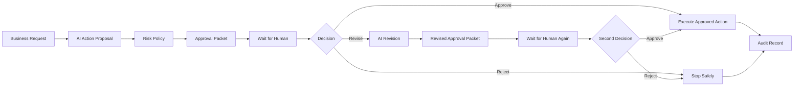

# Human-in-the-Loop AI Agent

A portfolio implementation of an **approval-gated AI workflow** built with **n8n + LLMs**.

The agent can interpret a business request, propose an action, classify its risk, pause for a human decision, revise when feedback is provided, and execute only after approval.

> The included executor is intentionally simulated. The project demonstrates the control pattern without sending real emails, changing CRM records, publishing content, or modifying production data.

## What this project demonstrates

- structured AI action proposals
- deterministic risk classification
- approval gates before consequential actions
- Approve / Revise / Reject paths
- a second approval gate after revision
- explicit human feedback
- bounded revision rather than uncontrolled agent loops
- audit records for decisions and execution
- asynchronous n8n Wait/webhook pattern
- separation between **AI proposal** and **business execution**

## Architecture



## Why human-in-the-loop?

LLMs are useful for interpreting requests and preparing actions, but some actions should not be executed just because a model generated them.

Examples include:

- sending a customer-facing email
- changing a CRM record
- publishing content
- approving a discount
- modifying business data
- triggering an external workflow
- deleting or overwriting records

This workflow keeps those two responsibilities separate:

```text
AI proposes
     ↓
policy evaluates risk
     ↓
human decides
     ↓
system executes
```

## Example request

```json
{
  "request": "Prepare a reply to a customer asking for a 20% discount. If approved, update the CRM note as well.",
  "requested_by": "sales-ops",
  "context": {
    "customer": "Northstar Labs",
    "current_plan": "Growth",
    "request_reason": "Annual renewal"
  }
}
```

The AI does **not** send the reply.

It first produces a structured proposal similar to:

```json
{
  "action_type": "apply_discount",
  "target": "Northstar Labs",
  "proposed_action": "Offer a 20% renewal discount and record the approved concession in CRM.",
  "draft_content": "Draft customer reply...",
  "reasoning": "The request concerns a commercial concession and external communication.",
  "confidence": 0.86
}
```

The deterministic policy then marks the proposal as high risk and requires human approval.

## Human decision contract

The n8n Wait node pauses the execution and exposes a runtime resume URL.

The reviewer sends one of:

### Approve

```json
{
  "decision": "approve",
  "reviewer": "harpreet",
  "feedback": "Approved as proposed."
}
```

### Revise

```json
{
  "decision": "revise",
  "reviewer": "harpreet",
  "feedback": "Reduce the discount to 10% and make the email less formal."
}
```

### Reject

```json
{
  "decision": "reject",
  "reviewer": "harpreet",
  "feedback": "Do not offer a discount."
}
```

A revised proposal must pass through a **second approval gate**. Revision never implies automatic approval.

## Risk policy

The LLM proposes an `action_type`, but the **risk level is assigned by deterministic code**.

| Action type | Default risk |
|---|---|
| Internal summary / draft only | Low |
| Customer email | Medium |
| Publish content | Medium |
| CRM update | Medium |
| Apply discount / commercial change | High |
| Delete record | High |
| Financial / account change | High |
| Unknown action | Medium |

The project intentionally treats risk classification as a policy concern rather than an LLM opinion.

See [docs/risk-policy.md](docs/risk-policy.md).

## Repository structure

```text
.
├── workflow/
│   └── human-in-the-loop-ai-agent.json
├── examples/
│   ├── sample-request.json
│   └── sample-decisions.json
├── docs/
│   ├── architecture.md
│   ├── approval-contract.md
│   └── risk-policy.md
├── .env.example
├── LICENSE
└── README.md
```

## Workflow stages

### 1. Request intake
A webhook receives a business request and optional context.

### 2. AI action proposal
The model converts the request into a structured proposed action.

### 3. Risk policy
JavaScript assigns a risk level and determines why approval is required.

### 4. Approval packet
The workflow creates a reviewable packet containing the original request, model proposal, risk level, and execution resume URL.

### 5. Human decision
The execution pauses at an n8n Wait node until a reviewer responds.

### 6. Revision path
If the reviewer chooses `revise`, feedback is sent back to the model. The revised action then pauses at a second approval gate.

### 7. Approved execution
The demo executor records what **would** be executed. It deliberately does not call a real production service.

### 8. Audit record
The final output captures the proposal, reviewer, decision, feedback, risk level, timestamps, and execution result.

## Setup

### 1. Import into n8n

Import:

```text
workflow/human-in-the-loop-ai-agent.json
```

### 2. Connect an LLM credential

The workflow uses an OpenAI-compatible chat model by default. You can replace it with another n8n-supported model.

### 3. Submit a request

POST the contents of:

```text
examples/sample-request.json
```

to the workflow webhook.

### 4. Open the execution

The **Prepare Approval Packet** node contains the runtime approval URL generated by n8n.

POST an approval decision to that URL.

For a revision, the **Prepare Revised Approval Packet** node exposes the second approval URL.

## Production adaptation

The node named **Execute Approved Action (Demo)** is intentionally a safe adapter.

In a real system it can be replaced with a sub-workflow or API call such as:

```text
approved action
      ↓
allow-listed executor
      ↓
email / CRM / CMS / internal API
      ↓
execution result
      ↓
audit log
```

The executor should validate the action again rather than trusting arbitrary model-generated URLs, SQL, or API requests.

## Planned validation

This repository is **not yet marked as tested**.

During the later testing pass, the workflow will be validated against scenarios including:

- approval without changes
- rejection
- revision followed by approval
- revision followed by rejection
- high-risk commercial action
- unknown action type
- malformed decision payload
- missing reviewer feedback
- attempts to bypass the approval step

Execution screenshots and test results will be added after validation.

## Acknowledgements

The workflow pattern was informed by public n8n approval examples, including **enzoemir1/n8n-telegram-approval**, particularly the use of n8n Wait nodes and resume webhooks.

This repository is an independent implementation with its own action schema, deterministic risk policy, revision path, second approval gate, audit model, and safe executor.

## License

MIT License. See [LICENSE](LICENSE).
